## ODBS Driver' ını indirme
İlk önce ODBC Oracle Driver' ini indirelim: [link](https://www.oracle.com/database/technologies/instant-client/downloads.html)

Yukarı linkten gerekli işletim sistemini seçin. Bu işlemler ``Windows``' a göre anlatılacaktır. Diğer OS' leri bilmiyorum.

Buradan ``Windows 32 bit`` olan seçtim. Çünkü 64 bit olanı ODBS 64 bit programında gözükmüyordu.

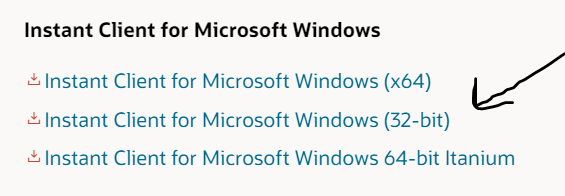

> Not: Docker Oracle db' si ``Version 12.2.0.1.0.`` ona göre indirelim. Bu sürümü indirmek için kayıt olmanızı isteyecek.

Burada 3 şey indirmeniz gerekiyor:

Basic Package <br/>
ODBC Package <br/>
SQL*Plus Package

### ODBS Driver' ını kurmak

İnen zipleri aynı dosyaya çıkartın ve klasörü tutmak istediğiniz bir yere taşıyın (Bu klasör ile daha sonra PATH ayarları yapılacaktır ona göre bir yere taşıyın.)

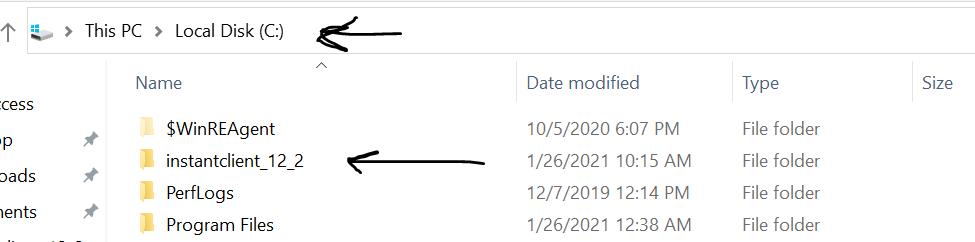

odbc_install.exe adlı programı çalıştırın. ODBC 32 bit programındaki drivers sekmesinde görmeniz gerekmektedir driver' ı.

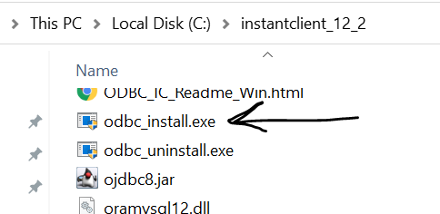

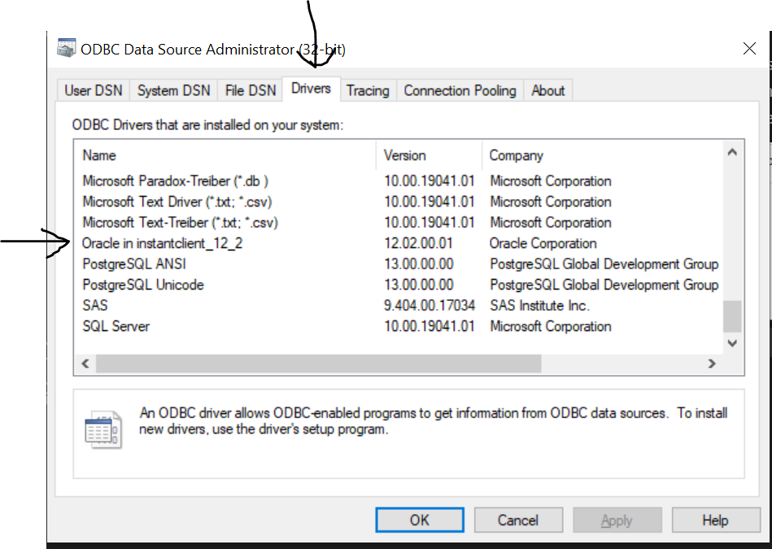

PATH ayarlamaları yapın:
Bir tane system variables ekleyin adı TNS_ADMIN olsun ve taşıdığınız dosyanın yolunu değer olarak yazın.
Birde bu yolu PATH adlı değişkene ekleyin.
Tamam deyip kapayın.

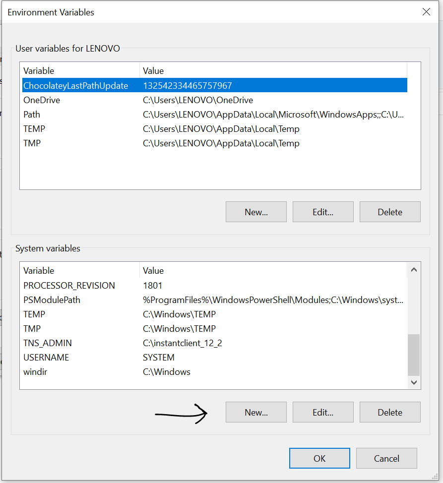
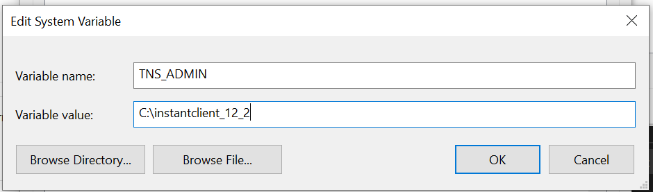
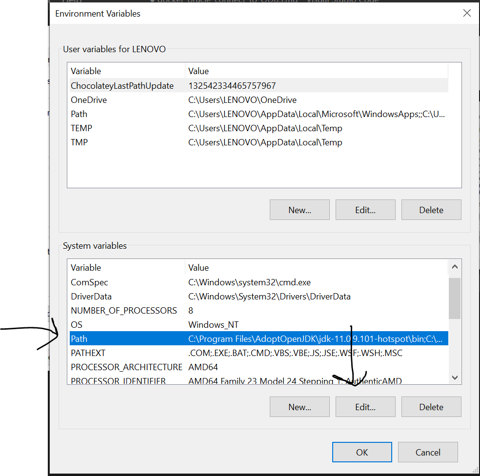
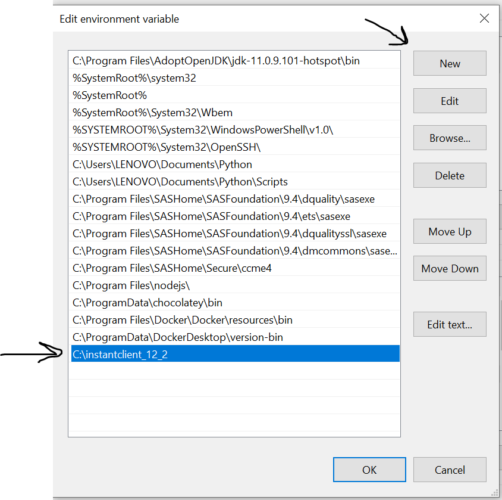


### Sıkıntılı Kısım

Şimdi sıkıntılı kısmına gelelim. Buradan sonrası karışık ben de nasıl oldu tam olarak bilmiyorum.

#### 1. adım
Yukarıdaki dosyaları attığınız ve klasörün içine ``tnsnames.ora`` adında bir dosya oluşturun ve içine aşağıdakileri yazın.

> Not: Veritabanına 2. adımdaki gibi bağlandım ve ``select * from dba_services;`` sorgusunu yazdım. Bu bana service isimlerini veriyor. Oradaki isim ``ORCLPDB1.localdomain`` idi. O yüzden aşağıdaki kodda ``SERVICE_NAME`` kısmında böyle yazıyor belki sizde farklıdır. Bilmiyorum.

```
net_service_name= 
 (DESCRIPTION= 
   (ADDRESS=(PROTOCOL=tcp) (HOST=localhost) (PORT=1521))
 (CONNECT_DATA=
     (SERVICE_NAME=ORCLPDB1.localdomain)))
```

#### 2. adım

CMD' yi açın ve şu komutu cmd' ye yazın. Bu komut ile veritabanına bağlanacağız.

```
sqlplus SYS/Oradoc_db1@//localhost:1521/ORCLPDB1.localdomain as SYSDBA
```

#### 3. adım

Bir tane user oluşturacağız.

```
CREATE USER <user_name> IDENTIFIED BY <user_password> DEFAULT TABLESPACE "USERS" TEMPORARY TABLESPACE "TEMP";

GRANT DBA TO <your_created_user_name>;
```

Daha sonra cmd' ye şunu yazın: `user_name` ve `password` yazmayı unutmayın.

```
sqlplus <your_user_name>/<your_password>@//localhost:1521/ORCLPDB1.localdomain
```

eğer ``connected to`` yazısını görürseniz başarılı bir şekilde çalıştı demektir. Şimdi ODBC' ye gidelim.

#### 5. adım

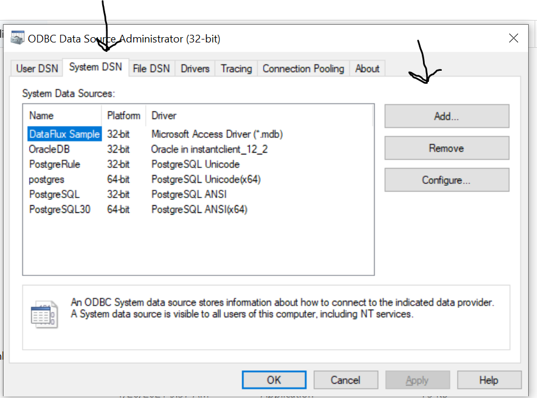
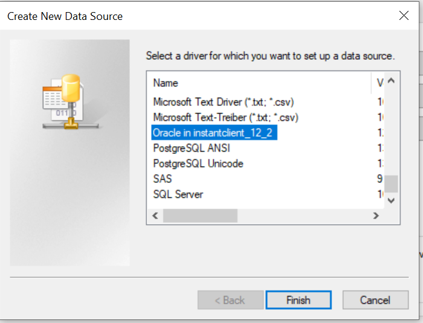
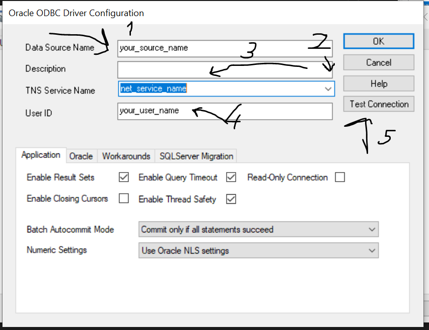
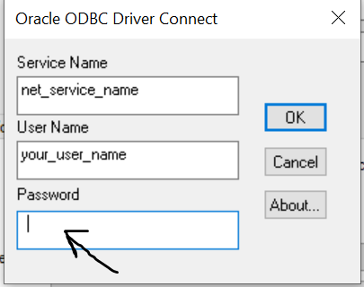
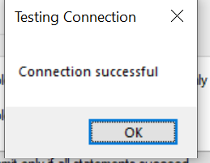
